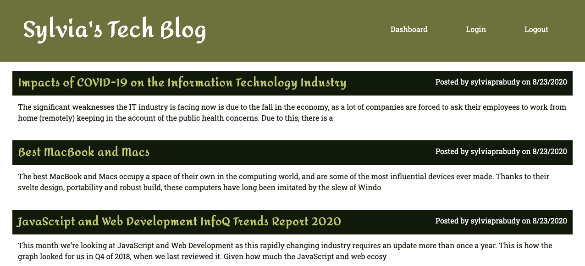

# Tech Blog


### Github : https://github.com/sylviaprabudy/tech-blog

### Heroku : https://tech-blog-0107.herokuapp.com

## Description
A CMS-style blog application with the MVC paradigm in its architectural structure, using Handlebars.js as the templating language, Sequelize as the ORM, and the express-session npm package for authentication.


## User Story
```
- AS A developer who writes about tech
- I WANT a CMS-style blog site
- SO THAT I can publish articles, blog posts, and my thoughts and opinions
```

## Usage
- App shows user the existing blogs on homepage.
- App allows user to sign up.
- User have to sign in to be able create a post.
- All the blog posts have title, contents, creator's name and date created.
- User have to sign in to be able leave a comment on a post.
- Signed-in user is able to update or delete their posts.
- User is automatically signed out of the site when user is idle for some period of time


## Screenshots



## Technologies Use
<p><a href="https://nodejs.org/">Node.js</a></p>
<p><a href="https://www.npmjs.com/package/express-handlebars">Express Handlebars</a></p>
<p><a href="https://www.npmjs.com/package/dotenv">dotenv</a></p>
<p><a href="https://www.npmjs.com/package/sequelize">Sequelize</a></p>
<p><a href="https://www.npmjs.com/package/mysql2">Node MySQL 2</a></p>
<p><a href="https://www.npmjs.com/package/bcrypt">node.bcrypt.js</a></p>
<p><a href="https://www.npmjs.com/package/express-session">express-session</a></p>
<p><a href="https://www.npmjs.com/package/connect-session-sequelize">connect-session-sequalize</a></p>
<p><a href="https://www.heroku.com/">Heroku</a></p>


## Contributor:
Sylvia Prabudy ©2020 All Rights Reserved.
- - -